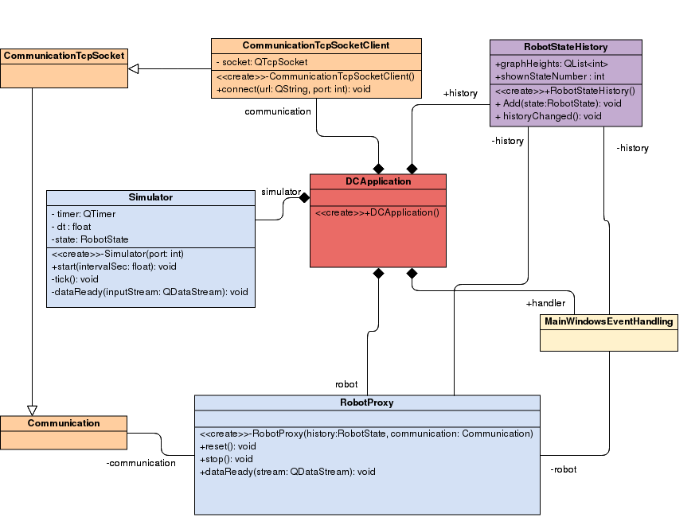
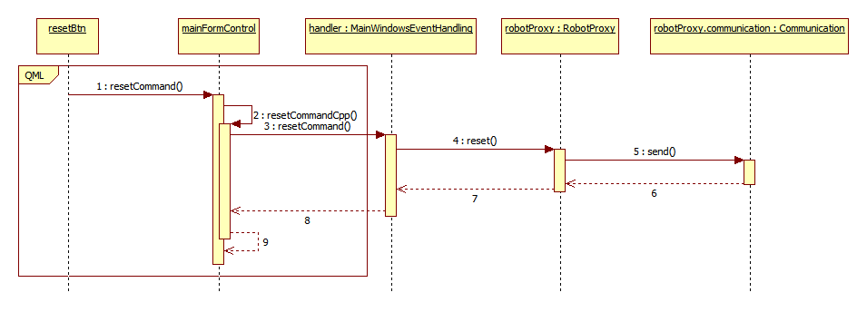

@mainpage
@tableofcontents

@section Csapat A csapat

## Csapatnév: AppMakers

### Csapattagok (név, Neptun-kód, e-mail cím):
- 
- 
- 

### Bemutató videó URL-je (max. 5 perc): https://youtube.com/

   

@section Architektura Architektúra áttekintés

A Drawing Car (DC) alkalmazás három részből tevődik össze. Az első részben a jármű ábrázolása és annak szimulációja történik, ahol a jármű állapotai vannak lekövetve, továbbá ezeket az állapotokat eltárolja, hogy a későbbiekben felhasználható legyen a megjelenítés során. A második rész a felhasználói felület, itt egy QML alapú megjelenítés teszi lehetővé különböző nyomógombok és csúszkák, illetve a jármű aktuális és eltárolt állapotainak megvalósítását. A harmadik rész a kommunikáció, ahol a szimulációval való TCP/IP kommunikáció valósul meg. Az adatcsomagok egyetlen osztály példányait küldik mindkét irányba, amiben a pontos állapotok és a parancsok kerülnek továbbküldésére.

@section DCApplication DCApplication: az alkalmazás osztály

Az DCApplication osztály egyetlen példányát hozza létre a main() függvény. A konstruktor létrehozza a további objektum példányokat, összekapcsolja őket. A main() függvény ezután elindítja a Qt fő eseménykezelő ciklusát.

Az DCApplication környezetét az alábbi osztálydiagram ábrázolja:

A CommunicationTcpSocket példánya felelős minden kommunikációért a kliens irányból (a másik a szimulátor, mely a mélyén tartalmaz egy CommunicationTcpSocketServer objektumot).

A Simulator egy teljesen önállóan működő objektum, mely egy QTimer időzítő segítségével szimulálja a robot működését és küldi az állapotokat a RobotProxy számára és fogadja az esetleges parancsokat.

A RobotProxy képviseli a kliensben a robotot, annak korábbi és aktuális állapotát is.

A RobotStateHistory-t a RobotProxy használja az aktuális és korábbi állapotok tárolására. A RobotStateHistory új állapot érkezése esetén értesíti a felhasználó felületet, hogy frissíteni kell a megjelenítést.

A MainWindowsEventHandling felelős minden a felhasználói felületet érintő esemény lekezeléséért. Hozzá futnak be a GUI nyomógombjainak eseményei és a RobotStateHistory változásáról tájékoztató signal is.

@section Kommunikacio Kommunikáció 

A kommunikációért felelős osztályok egy általános kommunikációs interfészre (Communication osztály) épülnek. Ezt egészítik ki egy TCP/IP socket használatára, melynek két alesete van: a szerver és a kliens oldal. Ezt az alábbi osztály diagram szemlélteti:

A Communication bizonyos műveleteket (isConnected, sendBufferContent) még csak absztrakt metódus formájában tartalmaz. A működési alapelve, hogy a send() metódussal bármilyen objektumot ki lehet írni a küldési bufferbe, amire értelmezett az operator<< QDataStream-re. A send() metúdus ennek segítségével sorosítja az üzenet objektumot, majd a sendBufferContent() metódussal elküldi azt. Ebből a folyamatból csak a sendBufferContent() az, ami függ a tényleges kommunikációs implementációtól, így az itt még absztrakt.

Adatok fogadása esetén minden adat egy általános streambe érkezik (Communication::receiveStream) és egy signal (Communication::dataReady) jelzi, ha egy teljes üzenet megérkezett. Erre a dataReady() signalra iratkozik fel a RobotProxy, hogy fogadni tudja az üzeneteket.

A CommunicationTcpSocket azzal egészíti ki az ősosztályát, hogy itt már konkrét TCP/IP socketet használ. Itt van a socket specifikus kommunikációs műveletek (sendBufferContent és isConnected) implementációi.

A maradék két osztály, a kliens és a szerver gyakorlatilag csak a kapcsolat felépítésében és lebontásában különbözik, ezeknek az eltéréseknek a megvalósításával egészíti ki az ősosztályt.

A kommunikáció lényegében így néz ki:

  

Az adatküldés szekvencia diagramja a következő:

A küldéshez a Communication::send() elkéri a küldési adatstreamet (getSendStream() hívása), ebbe sorosítja a küldendő objektumot, majd a sendBufferContent() hívásával elküldi az adatokat.

Adatok fogadása esetén az alábbi szekvencia diagram foglalja össze az eseményeket:

A kommunikáció mélyén lévő QTcpSocket a kliens dataReceived slotján kereszül jelzi, hogy érkezett adat. Mivel ilyenkor nem biztos, hogy a bufferben már egy egész üzenet benne van, így a kommunikáció csak akkor szól tovább a RobotProxynak (a dataReady signaljával), ha elegendő adat összegyűlt. (Ezt onnan tudja, hogy az adatcsomagok elején mindig átküldi, hogy hány bájtból áll a teljes adatcsomag.)

Amennyiben egy teljes adatcsomag átjött, a RobotProxy ezt kiolvassa (ehhez létrehoz egy új RobotState példányt), majd azt továbbítja a RobotStateHistory példányának. A history pedig ezt egyrészt elmenti, másrészt a historyChange signal segítségével jelez a felhasználói felületnek, hogy frissíteni kell a megjelenítést.

Végezetül még a kommunikációval kapcsolatos signal-slot hálózat képe az alábbi:

(Az ábrán négyzetekben láthatók az érintett objektumok, bal oldalukon a slotjaik, jobb oldalon pedig a signaljaik, valamint ezek kapcsolatai.)

@section Robot Robot reprezentáció

A robot reprezentációját az alábbi osztály diagram foglalja össze:

A RobotProxy felelős a kliens többi része felé a kapcsolattartásért.

A robot pillanatnyi állapotát a RobotState osztály írja le. (A szimulátornak egyetlen RobotState osztály példánya van és mindent az alapján szimulál.) Feladata csak az információ tárolás.

A RobotStateHistory három formában is tárol RobotState-et:

  * container: egy std::vector<unique_ptr>, mely az összes tárolt állapot (aktuális és korábbiak is) tárolásáért felelős. Övé az "ownership", vagyis ennek a unique_ptr miatt ennek a vektornak a megszűnésekor szűnnek meg az állapotok is.
  * currentState: egy pointer az aktuális állapotra. Mivel az ownership a containeré, ezért ha változik az aktuális állapot, ezt a pointert nyugodtan át lehet állítani bármi egyéb teendő nélkül.
  * stateList: egy pointer lista a container minden elemére. Erre azért van szükség, mert a QML megjelenítés csak ilyen listához tud adatkötést felépíteni, a unique_ptr vectorhoz nem. 

@section Szimulator A szimulátor

A szimulátort a Simulator osztály foglalja magába, mely belül egy CommunicationTcpSocketServer és egy RobotState objektumra támaszkodik. Minden bejövő üzenetet azonnal feldolgoz és egy QTimer segítségével periodikusan lefuttatja a szimulációt. Minden szimulációs lépés után elküldi az állapotát.

@section UI Felhasználói felület

Az alkalmazás felhasználói felülete egy QML alapú GUI, melyben a QML oldal felelős az adatkötésért a RobotStateHistory felé, az ottani változások esetén a megjelenítés frissítéséért (RobotStateHistory.historyChanged signal), valamint a menük és nyomógombok kezeléséért.

A Reset nyomógomb megnyomása esetét mutatja be a következő szekvencia diagram:

A QML oldalon a resetBtn nyomógomb eseményét a mainFormControl resetCommand slotja kapja meg (onResetCommand), mely tovább küldi azt a resetCommandCpp signal formájában, ami már a C++ oldalon van bekötve a MainWindowsEventHandling resetCommand slotjába. Az itteni eseménykezelő meghívja a robotProxy.reset() metódust, ami pedig összeállítja a reset parancsot a robot számára és elküldi a Communication send() metódusával.

A többi nyomógomb ehhez hasonlóan működik.

